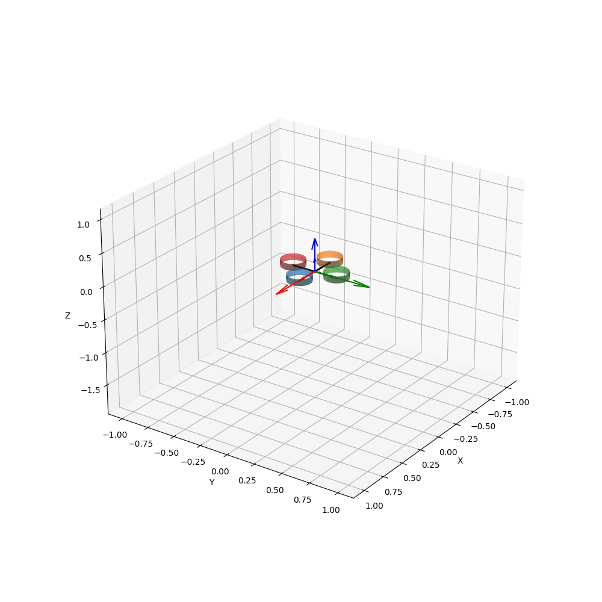

# pyCrazyflie
## Building Instructions
```
git clone --recursive git@github.com:IMRCLab/pyCrazyflie.git
cd crazyflie-firmware
make bindings_python
```
Add _cffirmware-firmware/_ to your `PYTHONPATH`. Open a terminal in the `pyCrazyflie/` directory and type
``` bash
 export PYTHONPATH=crazyflie-firmware/
```
## Simulation Structure
* [ ] The `controller.py` is the main file of this repository. The dynamics of the UAV is encoded within `uavDy/uav.py`.
* [ ] In order to execute a desired trajectory, add a `.csv` file in `trajectoriescsv/` folder in the following format:
  * [ ] each row must contain: time, desired position, desired velocity, desired acceleration. Such that, the desired position = [x, y, z], similarly for velocity and acceleration.
    ``` 
      *.csv file format
        rows: time, xd, yd, zd, vxd, vyd, vzd, axd, ayd, azd, jxd, jyd, jzd, sxd, syd, szd
    ```
### Initialization
* [ ] The `config/initialize.yaml` sets the all the required initialization for each robot (e.g., path for the trajectory of each robot, initial conditions, dynamic parameters, etc...)
* [ ] There are two modes. 
  * [ ] The first mode is initialized through `Robots`. This section is responsible for configuring the initialization of each individual robot in order to simulate it. A submode is defined, where it is possible to choose whether to attach a payload to each robot by changing the `[payload][mode]` between enabled and disabled.
  * [ ] The second mode is for multi-UAVs transporting and sharing a payload. This is encrypted in `[RobotswithPayload][payload][mode]`, whether it is shared or otherwise. Then it is possible to choose the controller for the full system by proving a reference trajectory to the payload, or defining the reference trajectory for each UAV. 
    * [ ] Note that: if  `[RobotswithPayload][payload][mode]` is set to otherwise. Then the configuration now assumes a single UAV (the other mode in the first point).
* [ ] For each mode, it is possible to choose the type of controller to use, whether it is the same controller used on the firmware through the python bindings, or a python-based controller saved in `controlllers/` directory.
* [ ] Please follow the comments in the config file to know the available options.
### Main File: `controller.py`
* [ ] To run the simulator, open the terminal in `pyCrazyflie/` directory and type the following command, providing an argument as the name of the pdf and video file that will be created after he simulation finishes running (i.e., choose a name for the file instead `name_of_the_file` )
  ```bash
    python3 controller.py name_of_the_file
    ```    
* [ ] In order to animate the simulation in a *.gif* format or save the generated plots in a pdf type this command
    ```bash
    python3 controller.py name_of_the_file --animate --plot
    ``` 
* [ ] `--animate` and `--plot` are flags. Their defaults are both False. 
* [ ] The animation will be saved in the `Videos` Directory, while the pdf will be saved in the main `pyCrazyflie` directory.
## Expected Output in Vidoes Directory

## TODOS:
* [ ] Add tests (with pytest) for different configuration of the config.yaml and examples folders.
* [ ] Use vispy.

