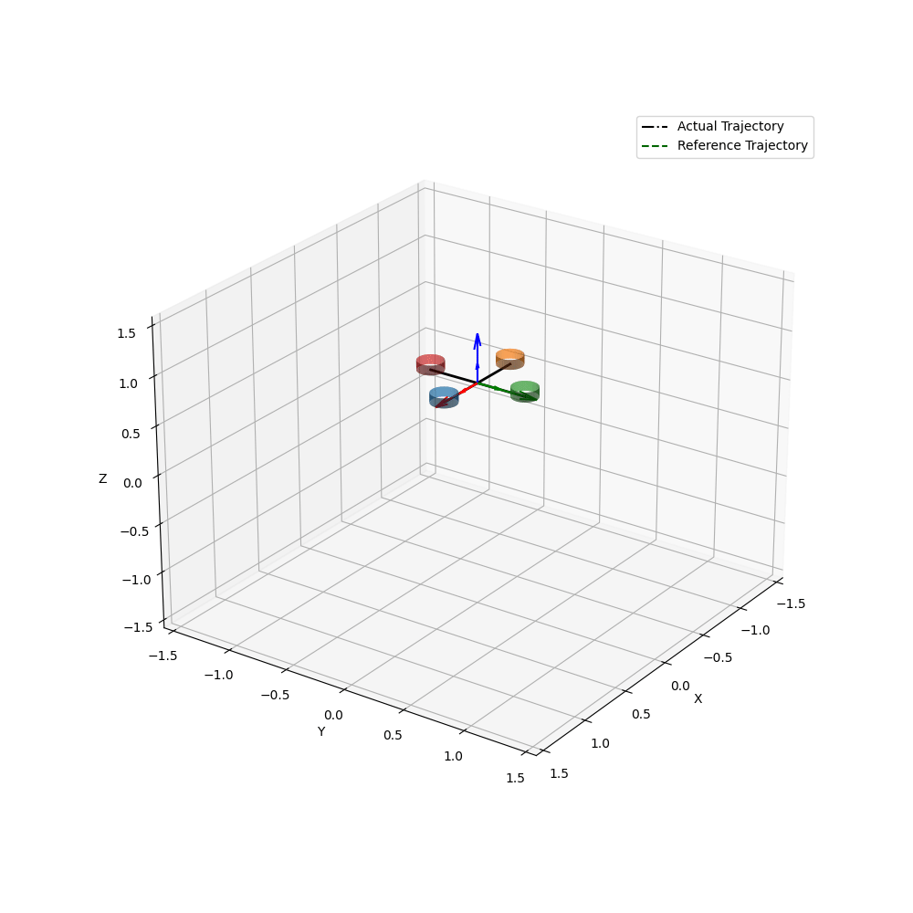

# pyCrazyflie
## Building Instructions
```
git clone --recursive git@github.com:IMRCLab/pyCrazyflie.git
cd crazyflie-firmware
make bindings_python
```
Add _cffirmware-firmware/_ to your `PYTHONPATH`. Open a terminal in the `pyCrazyflie/` directory and type
``` bash
 export PYTHONPATH=crazyflie-firmware/
```
## Simulation Structure
* [ ] The `controller.py` is the main file of this repository. The dynamics of the UAV is encoded within `uavDy/uav.py`.
* [ ] In order to execute a desired trajectory, add a `.csv` file in `trajectoriescsv/` folder in the following format:
  * [ ] each row must contain: time, desired position, desired velocity, desired acceleration. Such that, the desired position = [x, y, z], similarly for velocity and acceleration.
    ``` 
      *.csv file format
        rows: time, xd, yd, zd, vxd, vyd, vzd, axd, ayd, azd
    ```
### Main File: `controller.py`
* [ ] To run the simulator, open the terminal in `pyCrazyflie/` directory and type 
  ```bash
    python3 controller.py trajectorycsv/infinity8.csv 
    ```    
* [ ] In order to animate the simulation in a *.gif* format or save the generated plots in a pdf type this command
    ```bash
    python3 controller.py trajectorycsv/infinity8.csv --animate --plotSave
    ``` 
* [ ] `--animate` and `--savePlot` are flags. Their defaults are both False. 
* [ ] For the frequency of the frames to be shown in the plotting (and similar for the video), change the *sample* variable inside `controller.py` main function. 
* [ ] Finally, the initial state of the UAV  and the time step _dt_ are intialized in the following function
```python
  def initializeState():
    """This function sets the initial states of the UAV
        dt: time step
        initPose: initial position [x,y,z]
        initq: initial rotations represented in quaternions 
        initLinVel: [xdot, ydot, zdot] initial linear velocities
        initAngVel: [wx, wy, wz] initial angular velocities"""
```
___
## Expected Output in Vidoes/ Directory

